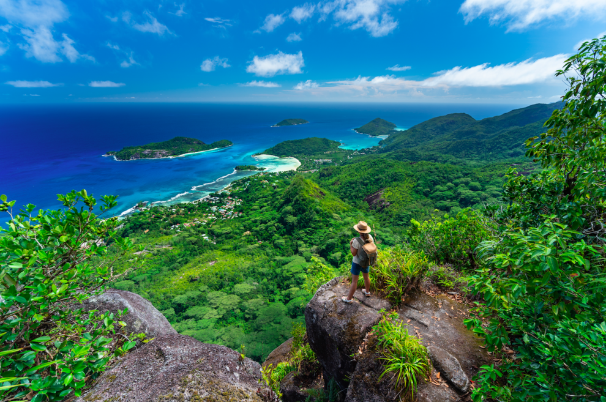
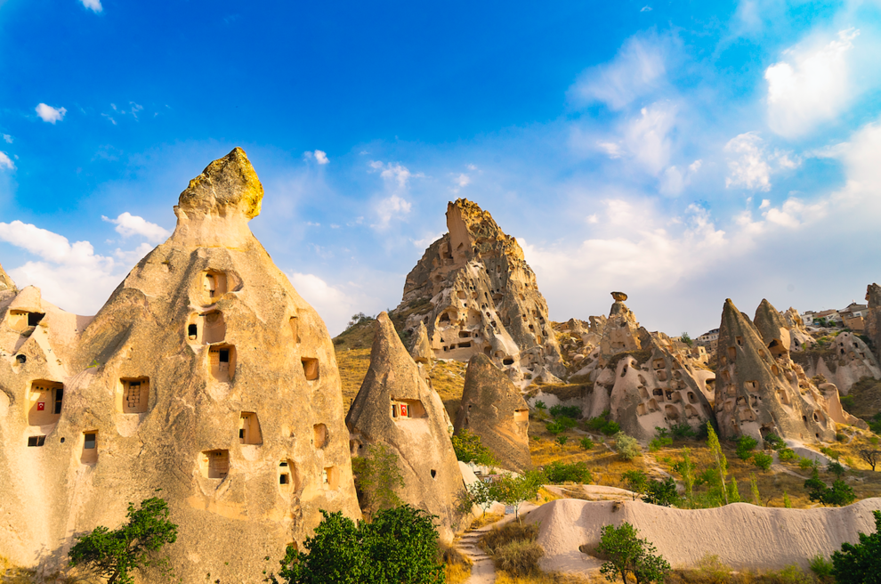
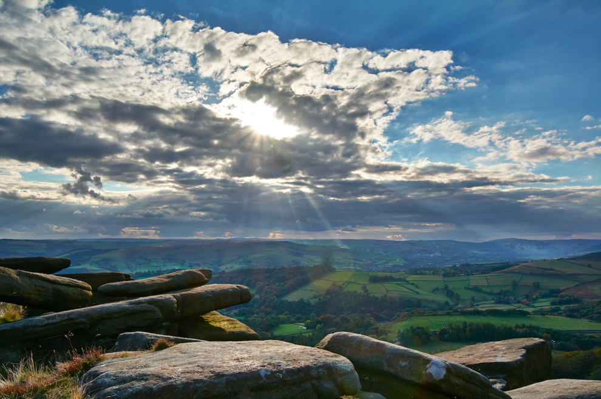
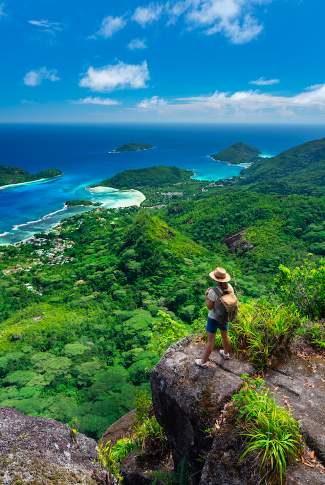
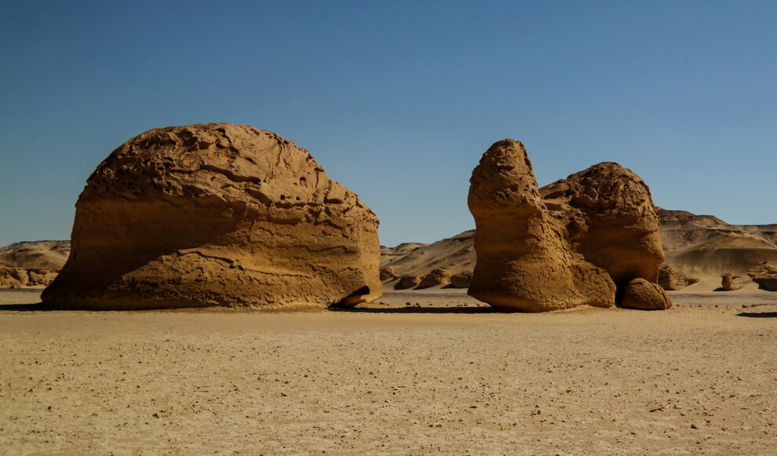

**Летний хайкинг: 5 пешеходных троп для активных выходных**

От зеленых ландшафтов Багамских островов до красной пустыни Турции, мы собрали самые живописные и увлекательные пешеходные тропы, которые можно изучить уже этим летом.

**Вершина Морн Блан на Сейшельских островах. Каппадокия, Турция**

Каппадокия находится в центральной части Турции и является полупустынным регионом страны. Среди туристов Каппадокия известна благодаря уникальным ландшафтам и обилию исторических достопримечательностей. Хайкинг здесь легко адаптируется под возможности туристов, так как гиды охотно предлагают тропы разного уровня сложности. Одни из самых популярных маршрутов проходят через долины Голубей и Любви, Красную долину и долину Роз, а также маршрут по долине Земли, где находятся скальные церкви.

**Скальный район Stanage Edge в Великобритания**

Один из самых красивых пешеходных маршрутов Англии, протяженностью десять с половиной километров, начинается и заканчивается в живописной деревне Хатерсейдж. Вообще, Stanage Edge – популярное место среди британских альпинистов, и вы поймете почему, дойдя до края Stanage Edge по зеленой тропе.

**Andros - Побережье Багамских островов с пальмами.**

Для полноты впечатлений на Багамских островах не нужно ограничиваться исследованием глубин. Непременно отправляйтесь в национальный парк Blue Holes National Park, где помимо голубых дыр и бегущих ручьев можно познакомиться с 20 разновидностями диких орхидей и 120 видами птиц. В джунглях парка легко потеряться, поэтому наймите гида и не забудьте удобную обувь.

**Morne Blanc Trail, Сейшельские острова -  Вершина Морн Блан**

Реальность такова, что до пика Морн Блан, с которого открывается душещипательный вид, ведет полуторакилометровый извилистый путь, в течение которого можно встретить туман и непременно карабкаться по гористой местности сквозь чайные плантации. Говорят, оно того стоит. Ведь вид с пика открывается на весь остров и соседние районы. В дорогу лучше отправляться утром, чтобы избежать тумана и солнца.

**Долина китов, Египет - Вади-аль-Хитан**

Долина китов в Египте, известная как Вади-аль-Хитан по-арабски – это место, где можно отследить эволюцию кита от наземного животного до океанического млекопитающего. Долина входит в список Всемирного наследия ЮНЕСКО и является популярным местом среди туристов, жаждущих активного отдыха. Ровные ландшафты делают Долину китов доступной для начинающих хайкеров, а также сюда можно приезжать для кемпинга, каякинга, катания на лошадях и наблюдения за звездами – с пустыни они смотрятся особенно эффектно.

